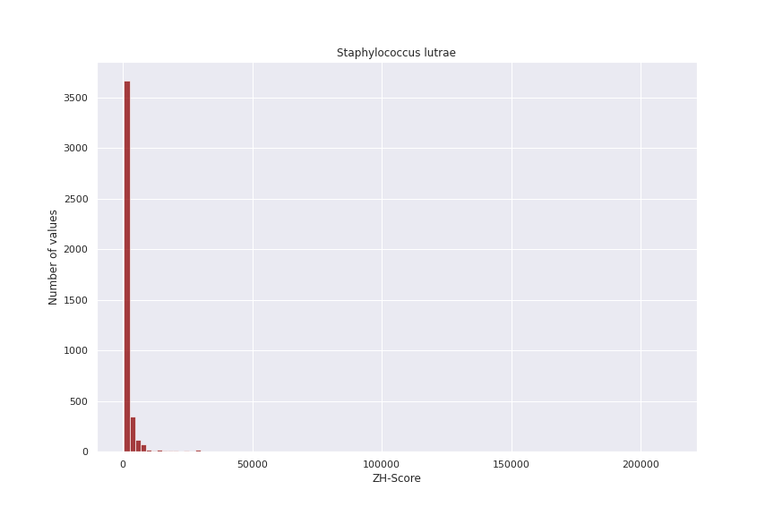
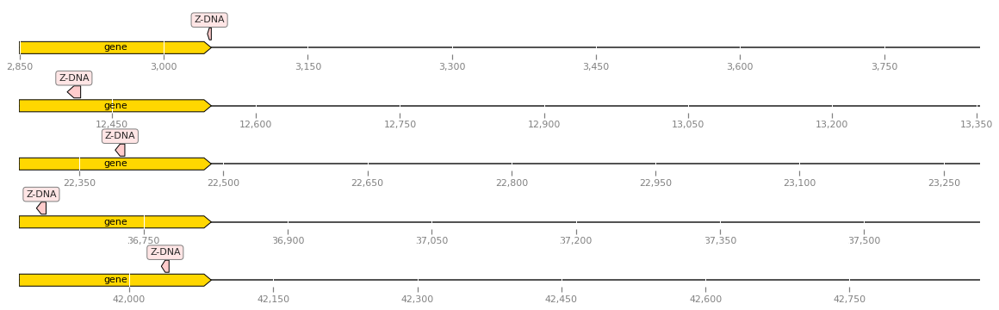

# hse22_project

### Выбранный таксон -- Firmicutes
### Род -- Staphylococcus

Ссылка на [Colab](https://colab.research.google.com/drive/1KvwGpGeUnkofNStrHkD7mnYE-YJotDiY?usp=sharing)

## Сводная таблица

|    | Название         |   Количество аннотированных генов |   Процент аннотированных генов в геноме |   Количество предсказанных участков Z-DNA |   Количество предсказанных участков Z-DNA с zh_score > 500 |   Общая длина участков с zh_score > 500 |
|---:|:----------------:|:---------------------------------:|:---------------------------------------:|:-----------------------------------------:|:----------------------------------------------------------:|:---------------------------------------:|
|  0 | auricularis      |                              2045 |                                 84.3701 |                                   2216575 |                                                       2508 |                                   25202 |
|  1 | lutrae           |                              2280 |                                 84.0969 |                                   2533115 |                                                       4303 |                                   43046 |
|  2 | muscae           |                              1985 |                                 86.444  |                                   2095116 |                                                       2208 |                                   22504 |
|  3 | pettenkoferi     |                              2303 |                                 83.011  |                                   2502360 |                                                       4445 |                                   44090 |
|  4 | pseudintermedius |                              2434 |                                 83.6547 |                                   2610514 |                                                       4306 |                                   42932 |

## Гистограммы ZH-Score

## Полученные гомологичные кластеры
Гистограмма распределения кластеров по количеству геномов | Гистограмма распределения кластеров по количеству генов
-|-
 |  

### Полученные кластеры и количество элементов в них
|  Количество генов  | # Zdna |
|:---|:---------|
|  0 |     1727 |
|  1 |      434 |
|  2 |       73 |
|  3 |       36 |
|  4 |       15 |
|  5 |        1 |

| Количество генов в кластере | Гены | Функции генов | Z-Hunt score |
|:---------------------------:|:----:|:-------------:|:------------:|
| 5 | QPT05479.1 | 50S ribosomal protein L19  | 583.4285 |
| 5 | WP_085238134.1 | 50S ribosomal protein L19 | 583.4285 |
| 5 | SNW01844.1 | 50S ribosomal protein L19 | 583.4285 |
| 5 | ASE35914.1 | 50S ribosomal protein L19 | 583.4285 |
| 5 | QQA47665.1 | 50S ribosomal protein L19 | 583.4285 |
| 4 | WP_037542446.1 | 30S ribosomal protein S9 | 1469.169 |
| 4 | WP_085237376.1 | tRNA uridine-5-carboxymethylaminomethyl(34) synthesis enzyme MnmG | 4576.539 |
| 4 | WP_085237165.1 | GbsR/MarR family transcriptional regulator | 650.9198 |
| 4 | WP_085237663.1 | glycerol-3-phosphate cytidylyltransferase | 650.9198 |
| 4 | WP_085237547.1 | ATP-dependent Clp protease ATP-binding subunit | 783.823 или 1117.472 |
| 3 | SNW00316.1 | excinuclease ABC subunit A | 3249.007 |
| 3 | SNW02578.1 | pyrroline-5-carboxylate reductase | 650.9198 |
| 3 | SNW01406.1 | phosphocarrier protein HPr | 766.6232 |
| 3 | SNW01418.1 | metallo-beta-lactamase superfamily protein | 883.5764 |
| 2 | ASE36419.1 | tRNA epoxyqueuosine(34) reductase QueG | 632.2504 |
| 2 | ASE37871.1 | bifunctional metallophosphatase/5'-nucleotidase | 1623.871 |
| 1 | QQA48679.1 | accessory Sec system protein Asp2 | 705.4245 |

## Визуализация

# G-квадруплексы

Предсказания G-квадруплексов успехом не увенчались. Всего нашлось 2 генома -- auricularis и lutrae, в которых нашлось по одному квадруплексу с достаточно низким скором. Гистограммы прикладываю только потому что отрисовывал их в одном скрипте, в них нет никакого смысла.

Гистограмма распределения G-квадруплексов у auricularis | Гистограмма распределения G-квадруплексов у lutrae
-|-
 | 
